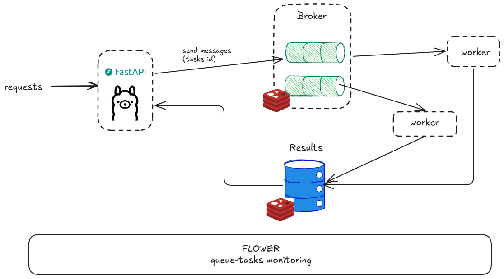

## Simple Ollama service with Celery and FastAPI
I’m trying to make my life less dull by spending time learning , researching and some hands-on “how it works“ in the AI/Data field.


### Tech - Begineer Level
- Celery : Message Queue
- FastAPI : Serving/Routing endpoints
- Docker : containerize
- Flower : Monitoring
- Ollama : OSS LLM (Sorry, I love open source)


### Quick start
```
docker-compose up -d
```


### Reference
https://medium.com/@simeon.emanuilov/ollama-with-fastapi-7f43cf532c43
https://github.com/zhanymkanov/fastapi-best-practices
https://github.com/derlin/fastapi-notebook-runner/tree/main
